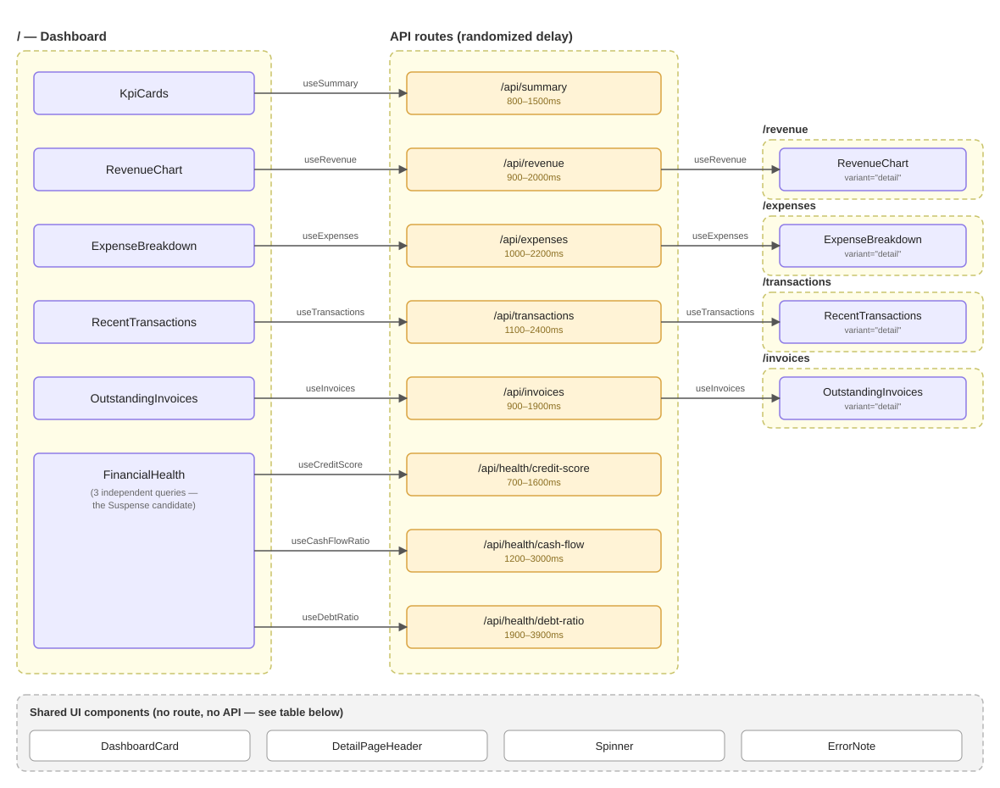

# Component → API dependency diagram

Shows every component in `01-client-fetching` that fetches data, which API
route it calls, and which page route it belongs to. Components that belong
to a single route are boxed and labeled with that route. Rows are aligned
so every dependency line is a straight horizontal segment — a component and
the API it calls always sit at the same height, with the API sitting
between the dashboard widget on the left and its detail-page counterpart
(if any) on the right.

`RevenueChart`, `ExpenseBreakdown`, `RecentTransactions`, and
`OutstandingInvoices` each render two ways from one component via a
`variant?: "widget" | "detail"` prop — the dashboard renders the default
`"widget"` variant (wrapped in `DashboardCard`, compact), its route page
renders the same component with `variant="detail"` (no card wrapper,
larger, includes a full data table). That's why the same four names appear
in both the left and right columns below.

## Shared UI component usage

These have no API dependency (hence no lines above), but are reused across
multiple routes:

| Shared component | Used by |
|---|---|
| `DashboardCard` | `RevenueChart`, `ExpenseBreakdown`, `RecentTransactions`, `OutstandingInvoices`, `FinancialHealth` |
| `DetailPageHeader` | the route `page.tsx` files: `/revenue`, `/expenses`, `/transactions`, `/invoices` |
| `Spinner` | every component above while its query is loading |
| `ErrorNote` | every component above if its query errors |

## Notes

- Each widget/detail pair is one component calling the same hook (and
  therefore the same TanStack Query cache key — `["revenue"]`,
  `["expenses"]`, etc.) regardless of `variant`. Navigating from a
  dashboard card title to its detail page reuses the cached data instantly
  if it's still fresh (`staleTime: 30s`); landing on the detail page
  directly triggers its own fetch and loading state.
- `FinancialHealth` is the one widget with three independent API calls
  inside a single component — see the comment in
  [`FinancialHealth.tsx`](../src/components/FinancialHealth.tsx) for why
  that makes it a deliberate `<Suspense>` candidate that this project
  intentionally does not use.
- `DashboardCard` and `DetailPageHeader` are plain presentational
  components with no hooks; they're only ever imported from Client
  Components here, but nothing about them requires that.
